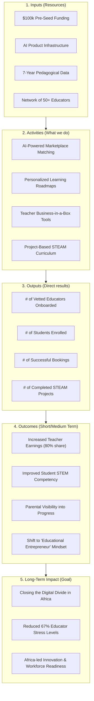

# Theory of Change: STEAM Spark

**Vision:** To democratize world-class STEAM education across Africa, empowering a generation of innovative problem-solvers and educational entrepreneurs.

---

## 🏗️ The Impact Framework

---

## 🔍 Narrative Summary

### 1. The Core Problem
Most EdTech solutions focus on content delivery but ignore the **delivery agents** (teachers). In Ghana, 67% of tutors face chronic stress due to late payments and high agency cuts. Meanwhile, parents lack visibility, and students lack personalized paths to mastery.

### 2. Our Intervention
We intervene by providing a **Creator Economy model** for teachers. By reducing commissions from 50% to 20% and providing AI-powered tools, we turn tired tutors into motivated entrepreneurs. This mindset shift directly translates into higher quality instruction for students.

### 3. The Logical Chain
*   **If** we provide teachers with better earnings and tools (**Inputs/Activities**)...
*   **Then** they will create more engaging and frequent STEAM sessions (**Outputs**)...
*   **Which leads to** students mastering complex skills like robotics and coding (**Outcomes**)...
*   **Ultimately** building a workforce ready for the 4th Industrial Revolution (**Impact**).

---

## 🛡️ Assumptions & Risks

| Category | Assumption | Mitigation Strategy |
|----------|------------|---------------------|
| **Technology** | Mobile penetration continues to rise in Ghana. | Platform optimized for low-bandwidth mobile views. |
| **Behavioral** | Teachers want to own their "brand." | Pre-onboarding series focuses on entrepreneurship coaching. |
| **Market** | Parents prioritize STEAM over traditional tutoring. | Marketing campaigns emphasize competition wins and workforce readiness. |

---

> [!NOTE]
> This Theory of Change is a living document and is validated through regular pre/post-test assessments and teacher income tracking.
