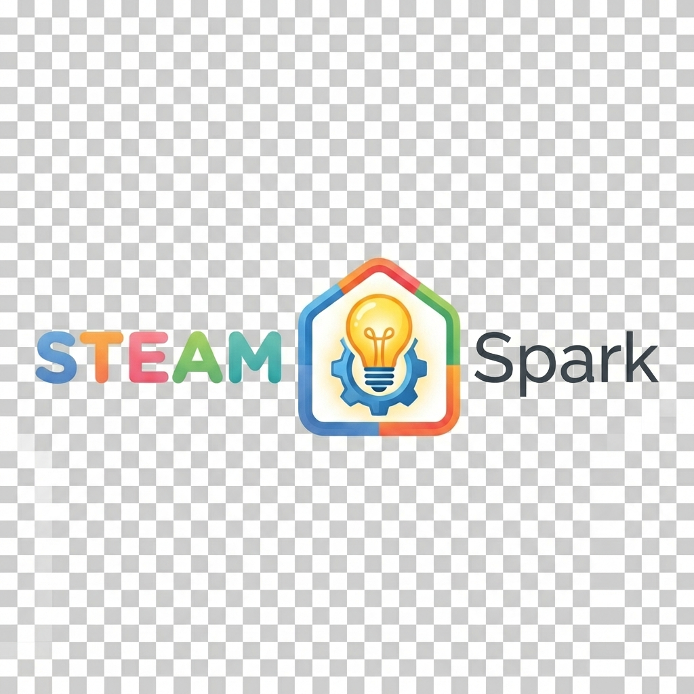

# STEAM Spark School Partnership Proposal
## Bringing Award-Winning STEAM Education to Your Students

---

**To:** School Administrator / Head of Academics  
**From:** STEAM Spark Ghana  
**Date:** February 2026  
**Subject:** Partnership Opportunity — Empowering Your Students with World-Class STEAM Education

---

## Executive Summary

STEAM Spark is Ghana's first technology-enabled STEAM education marketplace, connecting students with vetted educators in robotics, coding, science, and mathematics. With **7 years of proven results** and students winning continental competitions, we're now scaling our impact through an innovative tech platform.

**We're inviting your school to join our "Spark 100" founding partner program.**

---

## The STEAM Education Gap in Ghana

### Current Challenges:
- **Limited STEAM Resources:** Most schools lack specialized robotics/coding equipment and instructors
- **One-Size-Fits-All:** Generic curricula don't adapt to individual student abilities
- **No Progress Tracking:** Parents and schools can't measure STEAM skill development
- **Teacher Shortage:** Finding qualified STEAM educators is expensive and time-consuming

### The Opportunity:
Schools that offer robust STEAM programs see:
- **↑ 35% enrollment inquiries** from tech-savvy parents
- **↑ 50% competition participation** rates
- **↑ University admission success** for students with strong STEAM portfolios

---

## Our Solution: STEAM Spark Platform

### What We Offer Your School

#### 1. School-Wide STEAM Program
- **Curated educator pool:** 50+ vetted STEAM teachers specializing in:
  - Robotics & Engineering
  - Coding & Computer Science
  - Mathematics & Problem-Solving
  - Science Experiments & Research
- **Flexible delivery:** After-school clubs, weekend workshops, or integrated curriculum support

#### 2. AI-Powered Learning Pathways
- Personalized roadmaps for each student based on age, interests, and skill level
- Real-time progress tracking visible to teachers and parents
- Gamified achievements to boost engagement

#### 3. Parent Engagement Portal
- Dashboard showing child's STEAM activity and milestones
- Direct messaging with assigned educators
- Transparent pricing and session scheduling

#### 4. Competition Preparation
Our students have won:
- 🥇 **Africa Code Challenge** (Continental Winner)
- 🤖 **CoderZ Cyber Robotics League** (International Finalist)

We can prepare your students for similar competitions.

---

## Partnership Model: Revenue-Sharing Program

### Zero Upfront Cost — Earn Passive Income

We're offering schools a **win-win partnership** where you provide access to your parent community, and we share revenue from every booking.

---

### How It Works

#### Step 1: School Grants Access
- Allow STEAM Spark to present to your parent association
- Include STEAM Spark in school newsletters/communications
- Share parent contact list (email/WhatsApp) for opt-in marketing
- Optional: Host STEAM demo day for parents and students

#### Step 2: Parents Book Directly
- Parents sign up on STEAM Spark platform
- Select educators based on child's needs
- Book and pay for sessions independently
- School code tracks referrals automatically

#### Step 3: School Earns Commission
- STEAM Spark takes **20% commission** from each booking
- School receives **30% of our commission** (6% of booking value)
- Payments made monthly via bank transfer or mobile money
- Full transparency with booking dashboard

---

## Revenue Example

Let's say a parent from your school books a robotics tutor:

| Item | Amount |
|------|--------|
| **Session Cost** | GHS 200 |
| **Teacher Receives** | GHS 160 (80%) |
| **STEAM Spark Commission** | GHS 40 (20%) |
| **School's Share** | **GHS 12** (30% of GHS 40) |

If **50 parents** from your school book **4 sessions/month**:
- **Total Bookings:** 200 sessions/month
- **Avg. Session Cost:** GHS 150
- **School's Monthly Revenue:** **GHS 1,800**
- **School's Annual Revenue:** **GHS 21,600**

**All with zero investment. Zero overhead. Zero administrative work.**

---

### What's In It For Schools?

#### 1. Enhanced Educational Offering
- Position your school as forward-thinking and STEAM-focused
- Attract tech-savvy parents looking for comprehensive education
- Increase enrollment competitiveness

#### 2. Passive Revenue Stream
- No upfront cost, no risk
- Recurring monthly income as long as parents book
- Scales with your community's engagement

#### 3. No Administrative Burden
- We handle educator vetting, scheduling, payments
- Parents communicate directly with tutors via platform
- You simply facilitate the introduction

#### 4. Improved Student Outcomes
- Students gain STEAM skills outside regular curriculum
- Better preparation for university STEM programs
- Potential competition wins bring prestige to school

---

## Why Partner with STEAM Spark?

### 1. Proven Track Record
- **7 years** of STEAM education delivery in Ghana
- **150+ families** served, students winning **continental competitions**
- **$28,000** grant funding from Global Fund for Children
- Deep relationships with 50+ vetted STEAM educators

### 2. No-Risk Business Model
- **Zero upfront investment** — unlike hiring staff or buying equipment
- **No ongoing costs** — we handle all operations
- **Passive income** — earn while you sleep
- **Scalable** — the more engaged your parents, the more you earn

### 3. Enhanced School Reputation
- Position as innovative, tech-forward institution
- Attract enrollment from STEAM-focused families
- Student success stories bring prestige (competition wins, university placements)

### 4. Turnkey Solution
- We handle **everything**: educator vetting, scheduling, customer support, payments
- Your admin burden: **zero**
- Full transparency with real-time dashboard tracking

### 5. Win-Win-Win
- **Schools:** Passive revenue + enhanced reputation
- **Parents:** Access to quality STEAM education
- **Teachers:** Fair pay + professional platform
- **Students:** Skills for the future

---

## Founding Partner Benefits (Limited Time)

As part of our **Spark 100 Launch**, the first 5 schools to partner receive:

✅ **Higher commission rate:** 35% of our commission (7% of booking value) instead of 30%  
✅ **Free STEAM Demo Day** for your parent community (worth GHS 2,000)  
✅ **Co-branded marketing materials** for school recruitment  
✅ **Priority educator matching** — best tutors offered to your families first  
✅ **Dedicated account manager** for personalized support  
✅ **Quarterly performance reports** — detailed analytics on parent engagement and revenue  

**Total Value:** GHS 5,000+ in benefits + Higher lifetime earnings

---

## Student Success Stories

### Kwame, Age 12 — Winner, Africa Code Challenge
> *"Before STEAM Spark, I didn't know what coding was. Now I've built my own games and competed against students from 15 countries. I want to study Computer Science at MIT."*

### Ama, Age 10 — Robotics Enthusiast
> *"I used to think robots were just in movies. Now I've built a line-following robot and learned how sensors work. I love problem-solving!"*

---

## Implementation Timeline

### Week 1: Partnership Setup
- Sign partnership agreement (MOU)
- Assign unique school referral code
- Set up commission tracking in dashboard
- Create co-branded marketing materials

### Week 2: Parent Engagement Launch
- STEAM Spark presents to parent association (30-45 min)
- Distribute marketing materials (flyers, emails, WhatsApp)
- Host optional STEAM Demo Day (robotics/coding showcase)
- Parents begin signing up with school code

### Week 3-4: Activation & Monitoring
- Track parent signups and first bookings
- Weekly check-in with school admin
- Address any questions or concerns
- First commission payment processed (if threshold met)

### Ongoing: Monthly Reporting
- Detailed analytics emailed by 5th of each month
- Shows: new signups, active parents, total bookings, commission earned
- Quarterly strategy calls to optimize engagement

---

## Next Steps

### Schedule Your Free Demo
We'd love to show you the platform in action and discuss how STEAM Spark can elevate your school's offerings.

**Contact:**  
📧 **Email:** hello@steamsparkgh.com  
📱 **WhatsApp:** [Your Number]  
🌐 **Website:** steamsparkgh.com  
📅 **Book Demo:** [Calendly Link]

### Demo Includes:
- Live walkthrough of teacher and parent dashboards
- Sample AI Learning Roadmap for a student
- Q&A with STEAM Spark founder, Triumph Tetteh
- Customized proposal based on your school's needs

---

## Frequently Asked Questions

**Q: Do we need to pay anything upfront?**  
A: No. This is a **zero-cost partnership**. You only earn money; you never spend it.

**Q: How do you track which parent came from our school?**  
A: Every school gets a unique referral code. Parents enter it during signup, and all their bookings are automatically attributed to your school.

**Q: When do we receive payments?**  
A: Monthly, by the 5th of each month. Payments sent via bank transfer or mobile money. Minimum payout threshold is GHS 100.

**Q: What if a parent stops using the platform?**  
A: You only earn commission on active bookings. If a parent books 10 sessions, you earn from those 10. If they pause, resume, or switch educators, you still earn as long as they're using their school-linked account.

**Q: Do we need to provide equipment or educators?**  
A: No. We handle everything: educator recruitment, vetting, materials, scheduling, and payments. Your only role is facilitating the initial introduction to parents.

**Q: Can we customize what's offered?**  
A: Absolutely. If your school wants to emphasize certain STEAM subjects (e.g., robotics for a STEM-focused school), we can tailor our marketing materials accordingly.

**Q: What happens if parents complain?**  
A: STEAM Spark handles all customer support. Parents contact us directly. We have a 100% satisfaction guarantee and will issue refunds if needed. Your reputation is protected.

**Q: How many schools are you partnering with?**  
A: We're limiting this to **10 schools** in the Spark 100 campaign to ensure quality and personalized service. First 5 get founding partner benefits (7% commission instead of 6%).

---

## About STEAM Spark

**Mission:** Democratizing STEAM education across Africa by empowering educators and connecting them with families.

**Team:**
- **Triumph Tetteh** — Founder & CEO, Product Developer
- **Ellen Swatson Hall** — Director of Child Education
- **Doreenda Danso** — Operations Lead
- **Felix Quaye** — Digital Communications Director

**Backed By:**
- Global Fund for Children (Grant Recipient)
- [Other Backers / Advisors]

---

**Let's Spark the Future of Your Students Together.**

*This proposal is valid until March 31, 2026.*

---

**STEAM Spark Ghana**  
Accra, Ghana  
📧 hello@steamsparkgh.com  
🌐 steamsparkgh.com
